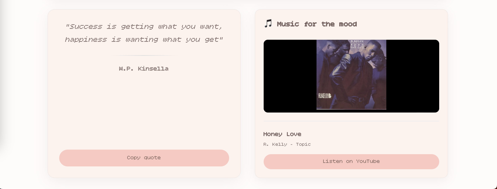
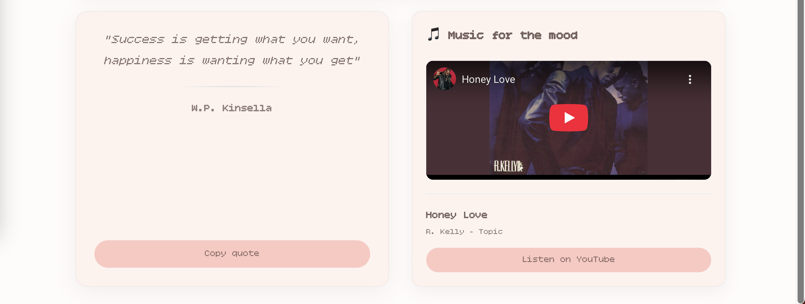

# Mood Listener 

**Умный подбор музыки и цитат по настроению**


## О проекте

Mood Listener — это веб-приложение, которое анализирует ваше настроение по тексту и подбирает идеальные цитаты и музыку. 

## Особенности

- Анализ текста на сентимент (положительный/отрицательный/нейтральный)
- Автоматический подбор музыки под настроение (YouTube Data API v3)
- Цитаты от известных авторов (API Ninjas)
- Адаптивный дизайн для всех устройств

## Технологии

### Frontend
- Vue 3 + Composition API
- Vite — сборщик
- CSS3 с Flexbox/Grid — адаптивная верстка
- ES6+ — современный JavaScript

### API и сервисы
- YouTube Data API v3 — поиск и встраивание музыки
- API Ninjas (Quotes) — база цитат известных авторов
- Сентимент-анализ — локальная обработка текста

## Пример работы:

<p align="center">
  
  
</p>

## Как запустить?

```bash
# Установите зависимости
npm install

# Настройте окружение
# Создайте файл .env в корне проекта:
# VITE_YOUTUBE_API_KEY=ваш_ключ_youtube_api
# VITE_NINJAS_API_KEY=ваш_ключ_ninjas_api

# Запустите в development режиме
npm run dev
```

### Получение API ключей

#### YouTube Data API v3

1. Перейдите на [Google Cloud Console](https://console.cloud.google.com/)
    
2. Создайте проект и активируйте YouTube Data API v3
    
3. Создайте API ключ в разделе Credentials
    
4. Добавьте ключ в `.env` файл
    

#### API Ninjas 

1. Зарегистрируйтесь на [api-ninjas.com](https://api-ninjas.com/)
    
2. Получите API ключ в личном кабинете
    
3. Добавьте ключ в `.env` файл


##  Как работает?

1. Пользователь вводит текст, описывающий настроение
    
2. Система анализирует сентимент (позитивный/негативный/нейтральный)
    
3. Подбираются цитаты из базы API Ninjas по категориям
    
4. Ищется музыка на YouTube по ключевым словам
    
5. Отображаются результаты в виде карточек

## Демо-версия

Демо-версия доступна по запросу.  
_Из-за ограничений бесплатных API ключей публичная демо-версия временно недоступна._

## Ограничения
    
- YouTube Data API v3: 10,000 запросов в день
    
- API Ninjas: 10000 запросов в месяц 
    
- Для личного использования ограничений достаточно
